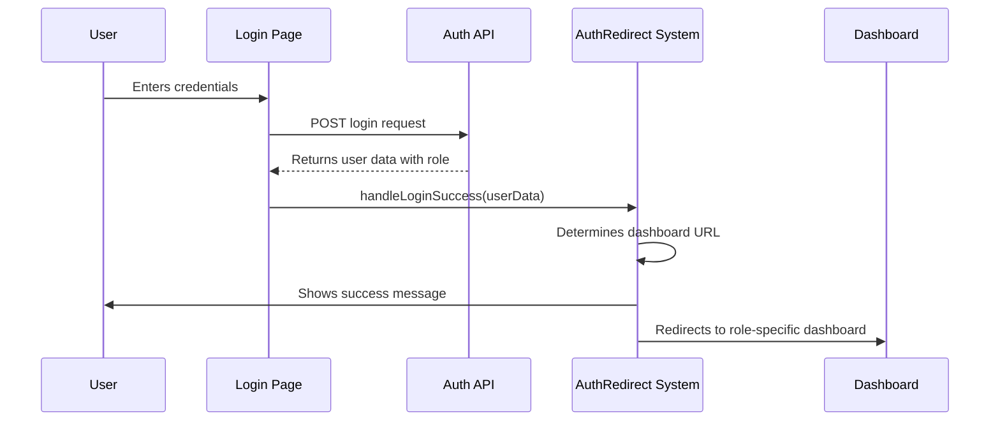
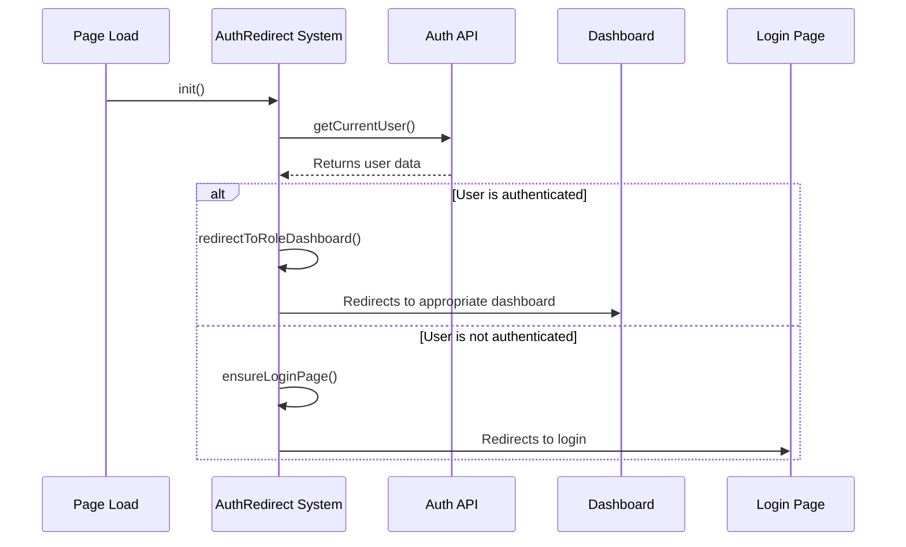

# Authentication and Role-Based Redirect System

## Overview

The QR Menu System now includes a comprehensive authentication and role-based redirection system that automatically directs users to their appropriate dashboards based on their user roles after login.

## Features

### 🎯 Role-Based Dashboards

The system supports the following user roles, each with their dedicated dashboard:

| Role | Dashboard File | Description |
|------|---------------|-------------|
| Super Admin | `dashboard-super-admin.html` | Full system overview and administration |
| Owner | `dashboard-owner.html` | Restaurant chain management |
| Manager | `dashboard-manager.html` | Restaurant-level management |
| Branch Manager | `dashboard-branch-manager.html` | Branch-specific operations |
| Chef | `dashboard-chef.html` | Kitchen and order preparation |
| Waiter | `dashboard-waiter.html` | Order taking and customer service |
| Staff | `dashboard-staff.html` | General restaurant operations |

### 🔐 Automatic Authentication

- **Login Detection**: Automatically checks if user is already authenticated
- **Role Detection**: Identifies user role from authentication response
- **Smart Redirection**: Redirects to appropriate dashboard based on role
- **Fallback Handling**: Falls back to default dashboard for unknown roles

### 🚀 Seamless User Experience

- **Loading States**: Professional loading messages during redirection
- **Success Feedback**: Clear confirmation messages for successful login
- **Error Handling**: Graceful error handling for failed authentication
- **Session Management**: Proper session validation and timeout handling

## File Structure

### Core Files

```
htdocs/
├── login.html                          # Updated login page with role redirection
├── test-auth-redirect.html             # Test page for verification
├── assets/js/
│   ├── auth-redirect.js               # Authentication redirect system
│   └── role-navigation.js             # Role-based navigation system
└── admin/
    ├── dashboard.html                   # Updated main dashboard (redirects to role-specific)
    ├── dashboard-super-admin.html      # Super Admin dashboard
    ├── dashboard-owner.html             # Owner dashboard
    ├── dashboard-manager.html           # Manager dashboard
    ├── dashboard-branch-manager.html   # Branch Manager dashboard
    ├── dashboard-chef.html             # Chef dashboard
    ├── dashboard-waiter.html           # Waiter dashboard
    └── dashboard-staff.html             # Staff dashboard
```

### Backend Integration

The system integrates with existing authentication API:

- **API Endpoint**: `/api/auth/index.php`
- **Login Action**: `POST /api/auth/?action=login`
- **User Data**: Returns user role in the response
- **Session Management**: Uses existing session-based authentication

## Implementation Details

### 1. Login Process Flow



### 2. Authentication Check Flow



### 3. Role Dashboard Mapping

```javascript
const roleDashboards = {
    'super_admin': 'admin/dashboard-super-admin.html',
    'owner': 'admin/dashboard-owner.html',
    'manager': 'admin/dashboard-manager.html',
    'branch_manager': 'admin/dashboard-branch-manager.html',
    'chef': 'admin/dashboard-chef.html',
    'waiter': 'admin/dashboard-waiter.html',
    'staff': 'admin/dashboard-staff.html'
};
```

## Usage

### For Developers

#### Using AuthRedirect Class

```javascript
// Static method for manual redirection
const dashboardUrl = AuthRedirect.redirectToDashboard('chef');
// Returns: 'admin/dashboard-chef.html'

// Handle login success
await AuthRedirect.handleLoginSuccess(userData);

// Handle logout
await AuthRedirect.handleLogout();
```

#### Integration with Existing Pages

1. **Include the script** in your HTML files:
```html
<script src="assets/js/auth-redirect.js"></script>
```

2. **Use the static methods** for authentication handling:
```javascript
// In login success handler
await AuthRedirect.handleLoginSuccess(result.user);

// In logout handler
await AuthRedirect.handleLogout();
```

### For Users

#### Login Experience

1. **Navigate to Login**: Users go to `login.html`
2. **Enter Credentials**: Email and password
3. **Automatic Redirection**: System automatically redirects to appropriate dashboard
4. **Role-Specific Interface**: Users see dashboard tailored to their role

#### Dashboard Features by Role

- **Super Admin**: System-wide statistics, restaurant management, user administration
- **Owner**: Multi-branch performance, financial overview, staff management
- **Manager**: Restaurant-level operations, branch oversight, performance metrics
- **Branch Manager**: Real-time order tracking, staff schedules, table management
- **Chef**: Kitchen operations, preparation queue, ingredient management
- **Waiter**: Order management, table service, customer feedback
- **Staff**: Task management, schedules, team communication

## Testing

### Test Page

Access `test-auth-redirect.html` to test:

- **Role Mappings**: Verify each role maps to correct dashboard
- **Authentication Status**: Check current authentication state
- **User Data**: Verify user information retrieval

### Manual Testing

1. **Login as Different Roles**: Test with users of different roles
2. **Direct URL Access**: Try accessing dashboards directly
3. **Session Timeout**: Test session expiration handling
4. **Logout Functionality**: Verify proper logout and redirection

### Expected Behavior

1. **Successful Login**: User redirected to role-specific dashboard
2. **Already Logged In**: User redirected to appropriate dashboard
3. **Session Expired**: User redirected to login page
4. **Invalid Credentials**: Error message shown, stays on login page
5. **Logout**: User redirected to login page

## Security Considerations

- **Session Validation**: Sessions are validated for authenticity and expiration
- **Role Verification**: User roles are verified from server-side authentication
- **Redirect Security**: All redirects are validated to prevent open redirects
- **Error Handling**: Graceful error handling prevents information leakage

## Browser Compatibility

- **Modern Browsers**: Chrome, Firefox, Safari, Edge
- **Mobile Support**: Responsive design works on mobile devices
- **JavaScript Required**: System requires JavaScript for functionality

## Performance

- **Fast Redirection**: Minimal delay between login and dashboard access
- **Efficient Loading**: Scripts are loaded asynchronously
- **Caching**: Browser caching utilized for static assets
- **Minimal API Calls**: Authentication status cached during session

## Troubleshooting

### Common Issues

1. **Not Redirecting After Login**
   - Check browser console for JavaScript errors
   - Verify authentication API is responding correctly
   - Ensure user role is properly set in database

2. **Redirecting to Wrong Dashboard**
   - Verify role mapping in `auth-redirect.js`
   - Check user role in database
   - Ensure role names match exactly

3. **Authentication Errors**
   - Check session configuration
   - Verify database connection
   - Ensure authentication API is accessible

### Debug Mode

Add this to your page for debugging:
```javascript
console.log('Current user:', await APIService.getCurrentUser());
console.log('Available roles:', Object.keys(AuthRedirect.roleDashboards));
```

## Future Enhancements

- **Remember Last Dashboard**: Option to remember user's last visited dashboard
- **Customizable Dashboards**: Allow users to customize their dashboard layout
- **Multi-Role Support**: Support for users with multiple roles
- **Dashboard Previews**: Show dashboard previews during login
- **Offline Support**: Basic functionality for offline scenarios

## Support

For issues or questions regarding the authentication and redirect system:
1. Check the troubleshooting section
2. Review browser console for errors
3. Verify API responses using browser developer tools
4. Test with the provided test page